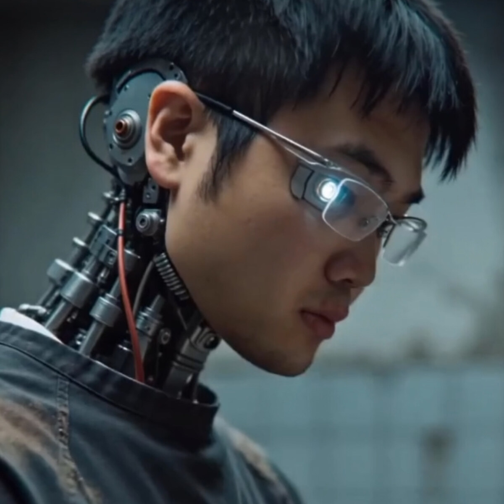

# 周子凌 Murphy Nile

在 VIRTURA 当前公开线索里，Murphy Nile 主要以写作者、跨媒体艺术家与数字空间方向的共创者出现。

与团队的关联，目前更多体现在 `Space Salon` 的分享、`Segla / 塞尼亚岛数字化旅居地` 的构想，以及围绕数字景观、节展观察和写作研究的持续交流里，而不是单一一个舞台版本里。

## Public View / 公开视图

- `object_id`: `control-uptime-protocol`
- `view_type`: `artist_context_view`
- `authorship_type`: `member_independent_work`
- `work_view`: [CONTROL: The Uptime Protocol](../works/control-uptime-protocol/README.md)
- `publication_view`: [VIRTURA 策展评论](https://github.com/ewanqian/VIRTURA-Newsroom/blob/main/art-review/articles/virtura_article_curatorial_v4.md)
- `prototype_page`: [CONTROL: The Uptime Protocol](../prototype/works/control-uptime-protocol.html)
- `deck_view`: `VIRTURA_Collective_Overview_2026 baked2.pdf` 第 7 页

当前页面是成员上下文页；正式作品入口看 [CONTROL: The Uptime Protocol](../works/control-uptime-protocol/README.md)。

## 当前公开角色

- 写作 / 研究
- 数字空间共创
- Space Salon 分享嘉宾
- 跨媒体艺术家 / Cross-media Artist

## Deck Bio / 展板简介

Murphy 的公开展板简介将其定位为跨媒体艺术家，工作横跨实时 3D、machinima 与视听系统，关注技术如何重构感知、欲望与行为逻辑。

英文短版：

> Works across real-time 3D, machinima, and audiovisual systems, exploring how technology reshapes perception, desire, and behavior.

## 主要参与内容

- [VIRTURA 空间茶话会 Vol.1｜云端续章](https://github.com/ewanqian/VIRTURA-SpacePort/tree/main/stations/space-salon/vol-01-cloud-sequel)：围绕国际新媒体艺术语境、数字空间和近期观察进行分享
- [VIRTURA 空间茶话会 Vol.0｜带上一段视觉，来客厅聊聊存档与远方](https://github.com/ewanqian/VIRTURA-SpacePort/tree/main/stations/space-salon/vol-00-archive-and-distance)：与 `Segla` 和数字远方相关的构想分享
- [Segla / 塞尼亚岛数字化旅居地](https://github.com/ewanqian/Senia-Digital-Resort)：数字空间方向的联合构想线索之一

## 主要负责方向

- 实时 3D、machinima 与 interactive audiovisual practice
- 数字景观、远方构想与跨媒体叙事
- 写作、研究与国际节展观察

## 作为讲者 / As Speaker

当前更适合从写作、研究、数字空间观察、跨媒体叙事和研究转 public program 的方向进入。

## 可分享主题

- 写作、研究与数字空间观察
- 跨媒体叙事与国际新媒体语境
- 如何把研究转成 public-facing 的表达

## 适合形式

- talk
- seminar
- critique
- virtual talk

## 适合对象

- 学校与研究社群
- 内容与写作团队
- 国际交流场景

## Programs 入口

- [Programs](../programs/README.md)
- [Talks](../programs/talks/README.md)
- [Virtual Talks](../programs/virtual-talks/README.md)
- [Booking](../programs/booking/README.md)

## 已公开可见线索

- [GitHub: MurphyNile](https://github.com/MurphyNile)
- [murphynile.com](http://www.murphynile.com)
- [CONTROL: The Uptime Protocol](https://www.murphynile.com/controlclub)
- [Lumen Prize 2025 Experiential Award Finalists](https://lumenprize.org/2025-experiential-award-finalists/murphy-nile-ziling-zhou)
- [murphy-nile-archive](https://github.com/MurphyNile/murphy-nile-archive)

## 如果本人愿意公开补充

- 与 `Segla` 或其他数字空间项目相关的公开页面
- 与团队活动相关的写作、研究或分享记录
- 更完整的个人简介与公开可引用资料
