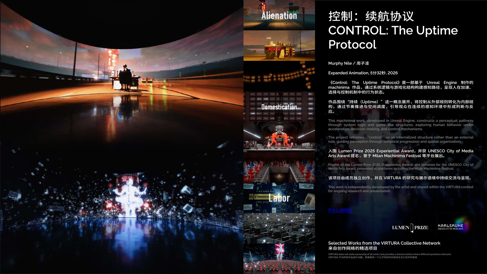

# CONTROL: The Uptime Protocol

`CONTROL: The Uptime Protocol` 是 Murphy Nile 的成员独立作品公开档案页。

它进入 `VIRTURA-Collective` 的原因不是团队宣称拥有这件作品，而是它说明 VIRTURA 网络中一条重要实践线：实时 3D、machinima、系统界面与控制结构如何成为叙事材料。

## Public View / 公开视图

- `object_id`: `control-uptime-protocol`
- `view_type`: `member_work_view`
- `authorship_type`: `member_independent_work`
- `artist_context`: [Murphy Nile](../../artists/murphy-nile.md)
- `publication_view`: [VIRTURA 策展评论](https://github.com/ewanqian/VIRTURA-Newsroom/blob/main/art-review/articles/virtura_article_curatorial_v4.md)
- `deck_view`: `VIRTURA_Collective_Overview_2026 baked2.pdf` 第 7 页

当前页面承担正式作品入口职责：稳定 object id、作品摘要、作者归属、credits、公开来源与相关公共语境。

## Authorship Boundary

- Artist: Murphy Nile
- Relationship to VIRTURA: member independent work
- VIRTURA role: public context, cross-link, network placement
- Medium: Expanded animation / machinima
- Runtime: 5 min 32 sec
- Year: 2026

VIRTURA 不声明拥有这件作品。这个页面只说明它如何与 VIRTURA 的研究、写作、实时影像和数字空间语境发生关系。

## Work Summary

`CONTROL: The Uptime Protocol` 是一件基于 Unreal Engine 制作的 machinima / expanded animation 作品，通过系统逻辑与游戏化结构构建感知路径，呈现人在加速、选择与控制机制中的行为状态。

作品围绕“持续 / Uptime”展开，将控制从外部规则转化为内部结构，通过节奏推进与空间调度，引导观众在连续的感知环境中形成判断与反应。

英文短版：

> This machinima work, developed in Unreal Engine, constructs a perceptual pathway through system logic and game-like structures, exploring human behavior under acceleration, decision-making, and control mechanisms.

## Public Recognition

- Finalist, Lumen Prize 2025 Experiential Award
- Nominated for the UNESCO City of Media Arts Award
- Presented through contexts including Milan Machinima Festival

## Credits

- Artist: Murphy Nile / 周子凌
- Production context: independently developed member work
- Public network context: VIRTURA Collective
- Source deck: `VIRTURA_Collective_Overview_2026 bake _7.jpg`
- Portrait source: `VAVA ID/三人照片/murphy.jpg`

## Public Context

当前公开语境中，这件作品最适合与 Murphy Nile 的写作、数字空间观察和跨媒体叙事一起阅读。

相关入口：

- [Murphy Nile](../../artists/murphy-nile.md)
- [Research](../../research/README.md)
- [Works](../README.md)
- [Prototype page](../../prototype/works/control-uptime-protocol.html)
- [VIRTURA 策展评论](https://github.com/ewanqian/VIRTURA-Newsroom/blob/main/art-review/articles/virtura_article_curatorial_v4.md)

## Public Sources

- [Murphy Nile: Control Club / CONTROL: The Uptime Protocol](https://www.murphynile.com/controlclub)
- [Lumen Prize 2025 Experiential Award Finalists: Murphy Nile / Ziling Zhou](https://lumenprize.org/2025-experiential-award-finalists/murphy-nile-ziling-zhou)
- [Deck OCR and corrected transcript](./source-notes.md)

## Remaining Checks

1. 若 Murphy 后续提供正式 artist statement，以本人版本为准。
2. 如需发布为正式网站，确认视频嵌入权限与 still image 授权。
3. 若增加中文媒体稿，继续保持“成员独立作品”边界。
