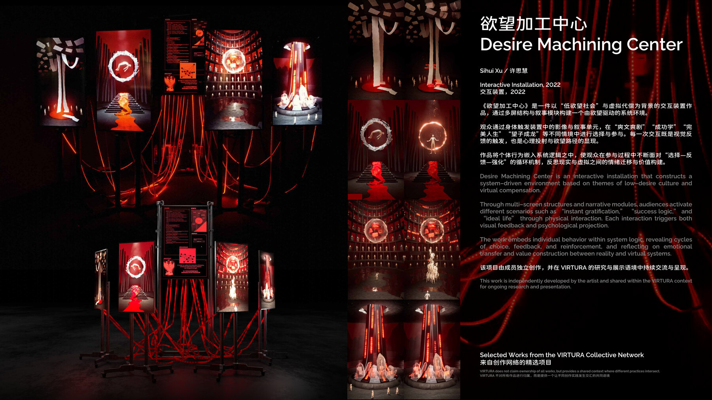

# Desire Machining Center / 欲望加工中心

`Desire Machining Center / 欲望加工中心` 是许思慧的成员独立作品公开档案页。

它进入 `VIRTURA-Collective` 的原因不是团队宣称拥有这件作品，而是它说明 VIRTURA 网络中另一条重要实践线：交互装置、欲望结构、选择反馈与社会心理机制如何被转化为可进入的作品结构。

## Public View / 公开视图

- `object_id`: `desire-machining-center`
- `view_type`: `member_work_view`
- `authorship_type`: `member_independent_work`
- `artist_context`: [Sihui Xu](../../artists/sihui-xu.md)
- `publication_view`: [VIRTURA 策展评论](https://github.com/ewanqian/VIRTURA-Newsroom/blob/main/art-review/articles/virtura_article_curatorial_v4.md)
- `deck_view`: `VIRTURA_Collective_Overview_2026 baked2.pdf` 第 8 页

当前页面承担正式作品入口职责：稳定 object id、作品摘要、作者归属、credits、公开来源与相关公共语境。

## Authorship Boundary

- Artist: Sihui Xu
- Relationship to VIRTURA: member independent work
- VIRTURA role: public context, cross-link, network placement
- Medium: Interactive installation
- Year: 2022

VIRTURA 不声明拥有这件作品。这个页面只说明它如何与 VIRTURA 的交互艺术、装置协作和公共评论语境发生关系。

## Work Summary

`Desire Machining Center / 欲望加工中心` 是一件以“低欲望社会”与虚拟代偿为背景的交互装置作品，通过多屏结构与叙事模块构建一个由欲望驱动的系统环境。

观众通过身体触发装置中的影像与叙事单元，在“爽文爽剧”“成功学”“完美人生”“望子成龙”等不同情境中进行选择与参与。每一次交互既是视觉反馈的触发，也是心理投射与欲望路径的显现。

作品将个体行为嵌入系统逻辑之中，使观众在参与过程中不断面对“选择-反馈-强化”的循环机制，反思现实与虚拟之间的情绪迁移与价值构建。

英文短版：

> Desire Machining Center is an interactive installation that constructs a system-driven environment based on themes of low-desire culture and virtual compensation.

## Credits

- Artist: Sihui Xu / 许思慧
- Production context: independently developed member work
- Public network context: VIRTURA Collective
- Source deck: `VIRTURA_Collective_Overview_2026 bake _9.jpg`
- Portrait source: `VAVA ID/三人照片/xusihui.jpg`

## Public Context

当前公开语境中，这件作品最适合与许思慧的交互艺术、装置协作和现场落地经验一起阅读。

相关入口：

- [Sihui Xu](../../artists/sihui-xu.md)
- [Programs](../../programs/README.md)
- [Works](../README.md)
- [Public page](../../works.html#desire-machining-center)
- [VIRTURA 策展评论](https://github.com/ewanqian/VIRTURA-Newsroom/blob/main/art-review/articles/virtura_article_curatorial_v4.md)

## Public Sources

- [中国美术学院设计艺术学院 2022 届本科生毕业作品展公开文章](https://www.sohu.com/a/554125819_121124733)
- [Deck OCR and corrected transcript](./source-notes.md)

## Rights And Contact

- Installation image, interaction video, and portrait use require artist permission.
- Public reference may cite title, artist, year, medium, and VIRTURA member independent work context with credit.
- Contact: [qianewan@gmail.com](mailto:qianewan@gmail.com)
